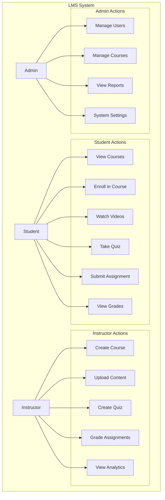

```mermaid
graph TD
    subgraph "LMS System"
        Student[Student]
        Instructor[Instructor]
        Admin[Admin]
        
        subgraph "Student Actions"
            S1[View Courses]
            S2[Enroll in Course]
            S3[Watch Videos]
            S4[Take Quiz]
            S5[Submit Assignment]
            S6[View Grades]
        end
        
        subgraph "Instructor Actions"
            I1[Create Course]
            I2[Upload Content]
            I3[Create Quiz]
            I4[Grade Assignments]
            I5[View Analytics]
        end
        
        subgraph "Admin Actions"
            A1[Manage Users]
            A2[Manage Courses]
            A3[View Reports]
            A4[System Settings]
        end
    end
    
    Student --> S1
    Student --> S2
    Student --> S3
    Student --> S4
    Student --> S5
    Student --> S6
    
    Instructor --> I1
    Instructor --> I2
    Instructor --> I3
    Instructor --> I4
    Instructor --> I5
    
    Admin --> A1
    Admin --> A2
    Admin --> A3
    Admin --> A4
```
